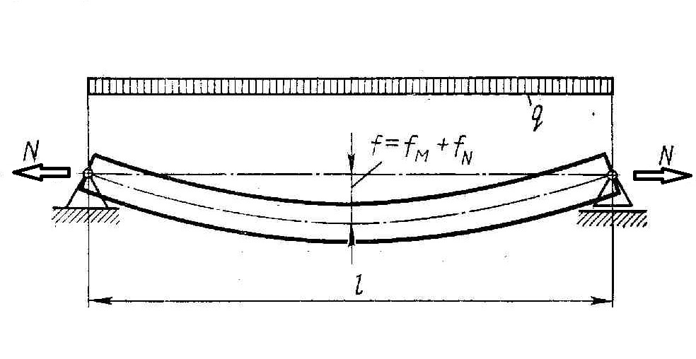

## ITMO.SoftwareEng2022.ProgTech
### ИТМО 2022. Технологии программирования

***Состав репозитория:***

 <strong>1. &#128194; Algoritm8CS. </strong> Алгоритм 8. Консольное приложение.
 
 <strong>2. &#128194; StrengthCS. </strong> Алгоритм расчета на прочность растянуто-изогнутого стального элемента. Консольное приложение.
 
